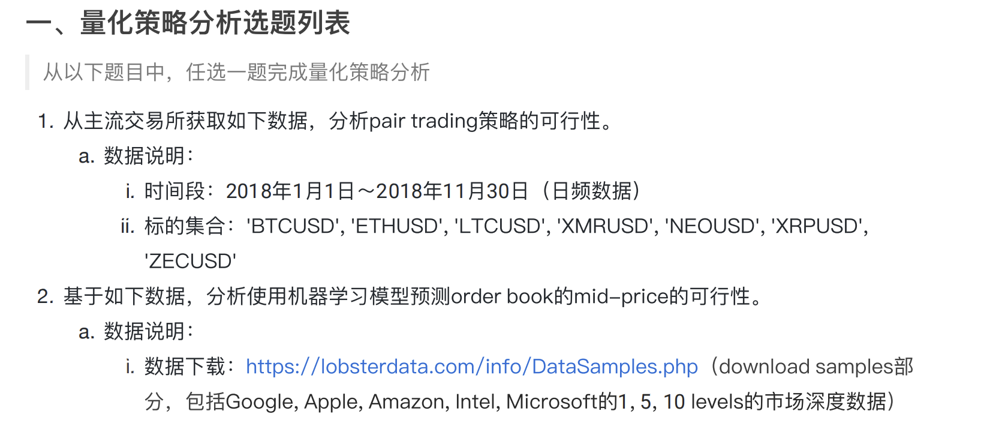

# machine_learning_hft
实验数据下对mid_price建模

* 对于问题1，现阶段还无法解决获取api的问题（应该需要境外服务器，以前在企业服务器可以获取数据，现在没有），参考代码datasource

> Max retries exceeded with url: /api/v3/klines?symbol=BTCUSDT&interval=1m&startTime=1646064000000&endTime=1646150400000&limit=1500 (Caused by NewConnectionError('<urllib3.connection.VerifiedHTTPSConnection object at 0x7f41ca03d400>: Failed to establish a new connection: [Errno 101] Network is unreachable'))

* 对于问题2，总结在了.ipynb文件里
  
